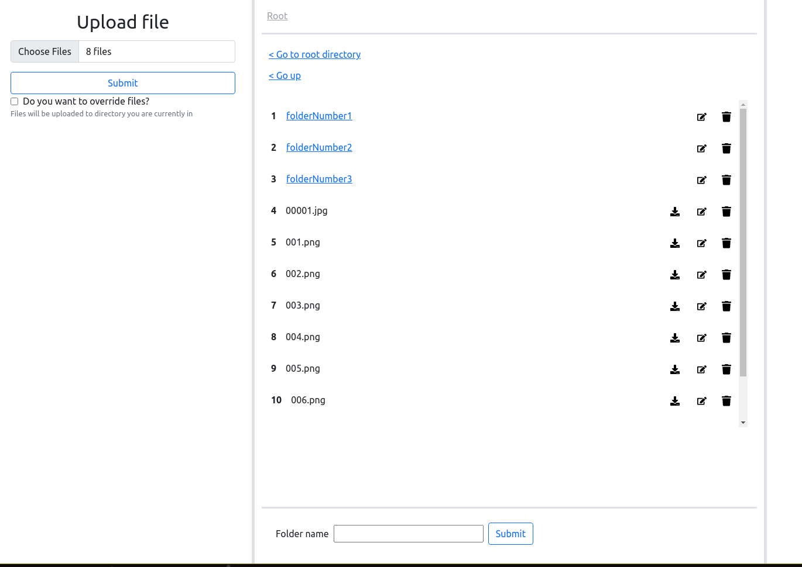

# Local File Uploader

As the name suggests, this project is all about sending and downloading files from local server. This project could be
easily replaced by something like **ftp**, but I wanted to learn few things, and in my experience, the best way to learn
is to just work on projects.

## Current Functionality

- Send files to local server
- Download files from local server
- Rename files
- Create new directories
- Delete directories

## Roadmap

- [ ] Add preview of files
- [ ] Add functionality to change permissions
- [ ] Set up https (Currently there is https implemented, but I turned it off because it was self-signed and caused
  trouble )
- [ ] Add some sort of simple text editor to quickly create basic notes and upload it to server(in my case my pc)
- [ ] Add option to edit text files
- [ ] Maybe rework UI. I'm not sure yet

## How to use

1. Download jar from **releases**
2. Create new folder for example **/home/[user]/uploader**
3. Put jar inside created folder
4. Run this command
    ````
    java -jar [downloaded jar] config 
    ````
5. This will start config setup that is required for this application to work
6. If you chose default upload location in this example it will be located **/home/[user]/uploader/upload**
7. Now you can start the application with
    ```
    java -jar [downloaded jar]
    ```
8. Now you have 2 options
  1. If you want to access it from computer that is hosting the application you can simply open browser and go to **
     localhost:8080**
2. In case you want to access application from mobile you will need to get the server ip. For example on arch linux use
   this command and copy second ip
   ```
   ip address | grep -w inet
   ```
   and paste it into browser with port 8080 for example
   ```
   192.168.50.42:8080
   ```

### Screenshots



### Warning

1. Application is not mobile friendly (yet)
2. Please do not set upload folder as your home directory or somewhere where you have important data!!! This application
   need a lot more testing, and I need to learn a lot more so please just don't do it
3. I do not take responsibility for any lost files(this application shouldn't be able to reach outside the upload folder
   but maybe there are some edge cases, but still you would actually need to click delete or edit and submit )

Icons used in project are from [FontAwesome](https://fontawesome.com/) 